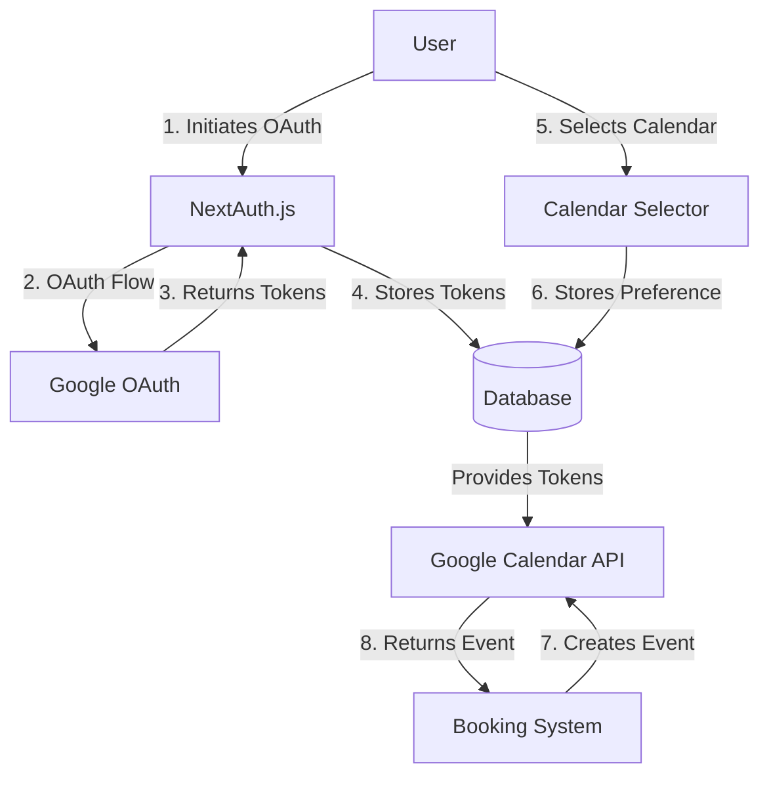

# Design Document: Google Calendar OAuth Integration

## Overview

This design document outlines the implementation approach for integrating Google Calendar with MeetMischief using OAuth 2.0. The feature will allow users to connect their personal Google Calendars, select which calendar to use for bookings, and have events automatically created in their calendars when bookings are made.

The implementation will leverage NextAuth.js for OAuth authentication and token management, with additional database schema changes to store user calendar preferences. This approach will replace the current service account-based implementation with a more user-centric, permission-based model.

## Architecture

### High-Level Architecture



### Component Interactions

1. **User Authentication Flow**:
   - User initiates Google OAuth connection from settings page
   - NextAuth.js handles OAuth flow with Google
   - Access and refresh tokens are securely stored
   - User is redirected back to settings with success message

2. **Calendar Selection Flow**:
   - System fetches user's calendar list using stored access token
   - User selects preferred calendar
   - Selection is stored in database
   - Default is primary calendar if none selected

3. **Booking to Calendar Flow**:
   - When booking is created, system checks if user has connected calendar
   - If connected, system uses user's access token to create calendar event
   - Event includes Google Meet link if virtual meetings are enabled
   - Booking record is updated with calendar event ID for future reference

## Components and Interfaces

### 1. NextAuth.js Google Provider Enhancement

Extend the existing NextAuth.js configuration to include Google Calendar scopes and token handling:

```typescript
// Enhanced Google provider configuration
GoogleProvider({
  clientId: process.env.GOOGLE_CLIENT_ID,
  clientSecret: process.env.GOOGLE_CLIENT_SECRET,
  authorization: {
    params: {
      scope: 'openid email profile https://www.googleapis.com/auth/calendar',
      access_type: 'offline',
      prompt: 'consent',
    },
  },
})
```

### 2. User Settings Interface

Create a new section in the user settings page for Google Calendar integration:

```typescript
interface CalendarConnectionProps {
  isConnected: boolean;
  calendars: GoogleCalendar[];
  selectedCalendarId: string | null;
  onConnect: () => void;
  onDisconnect: () => void;
  onCalendarSelect: (calendarId: string) => void;
}

interface GoogleCalendar {
  id: string;
  summary: string;
  primary?: boolean;
  backgroundColor?: string;
}
```

### 3. Google Calendar API Service

Create a service to handle Google Calendar API interactions:

```typescript
interface GoogleCalendarService {
  getUserCalendars(accessToken: string): Promise<GoogleCalendar[]>;
  createCalendarEvent(accessToken: string, calendarId: string, eventDetails: EventDetails): Promise<GoogleCalendarEvent>;
  updateCalendarEvent(accessToken: string, calendarId: string, eventId: string, eventDetails: EventDetails): Promise<GoogleCalendarEvent>;
  deleteCalendarEvent(accessToken: string, calendarId: string, eventId: string): Promise<void>;
}

interface EventDetails {
  summary: string;
  description: string;
  startDateTime: Date;
  endDateTime: Date;
  attendees: { email: string; name?: string }[];
  conferenceData?: boolean;
}

interface GoogleCalendarEvent {
  id: string;
  htmlLink: string;
  hangoutLink?: string;
}
```

### 4. Token Management Service

Create a service to handle OAuth token management:

```typescript
interface TokenService {
  refreshAccessToken(refreshToken: string): Promise<{ accessToken: string, expiresAt: number }>;
  revokeTokens(userId: string): Promise<void>;
}
```

## Data Models

### User Model Extensions

Extend the existing User model to store Google Calendar preferences:

```prisma
model User {
  // Existing fields...
  
  // Google Calendar fields
  googleCalendarId      String?
  googleCalendarEnabled Boolean @default(false)
  
  // NextAuth Account relation already exists
}
```

### Account Model Extensions

The NextAuth Account model already stores OAuth tokens, but we'll ensure it has the necessary fields:

```prisma
model Account {
  // Existing fields...
  
  // These fields are already part of NextAuth.js Account model
  access_token      String?  @db.Text
  expires_at        Int?
  refresh_token     String?  @db.Text
  scope             String?
  token_type        String?
}
```

### Booking Model Extensions

Extend the Booking model to store Google Calendar event information:

```prisma
model Booking {
  // Existing fields...
  
  // Google Calendar fields
  googleEventId     String?
  googleEventLink   String?
}
```

## Error Handling

1. **OAuth Connection Errors**:
   - Handle authorization rejection by user
   - Handle API errors during OAuth flow
   - Provide clear error messages to users

2. **Token Refresh Errors**:
   - Implement exponential backoff for failed refresh attempts
   - Mark connection as requiring reconnection if refresh token is invalid
   - Log detailed error information for debugging

3. **Calendar API Errors**:
   - Handle rate limiting with appropriate retry mechanisms
   - Gracefully handle permission errors
   - Continue with booking creation even if calendar event creation fails

## Testing Strategy

1. **Unit Tests**:
   - Test OAuth token management functions
   - Test calendar API service functions with mocked responses
   - Test UI components in isolation

2. **Integration Tests**:
   - Test OAuth flow with mock Google OAuth server
   - Test calendar event creation end-to-end
   - Test token refresh mechanisms

3. **End-to-End Tests**:
   - Test complete user journey from connection to booking creation
   - Test error scenarios and recovery

4. **Security Tests**:
   - Verify token storage security
   - Test permission boundaries
   - Verify proper scope usage

## Security Considerations

1. **Token Storage**:
   - Store access and refresh tokens securely
   - Use encryption for sensitive data
   - Implement proper token lifecycle management

2. **Scope Limitations**:
   - Request only necessary Google Calendar scopes
   - Use read-only scopes where possible
   - Clearly communicate requested permissions to users

3. **Data Protection**:
   - Implement proper access controls for calendar data
   - Do not cache or store calendar data unnecessarily
   - Ensure calendar events contain only necessary information

## Implementation Phases

1. **Phase 1: OAuth Integration**
   - Set up Google OAuth with NextAuth.js
   - Implement token storage and management
   - Create UI for connecting/disconnecting Google Calendar

2. **Phase 2: Calendar Selection**
   - Implement calendar list fetching
   - Create UI for calendar selection
   - Store and manage user calendar preferences

3. **Phase 3: Event Creation**
   - Implement calendar event creation
   - Update booking flow to create calendar events
   - Handle error cases and fallbacks

4. **Phase 4: Event Management**
   - Implement event updates and cancellations
   - Add synchronization between bookings and calendar events
   - Implement background jobs for token refresh and sync