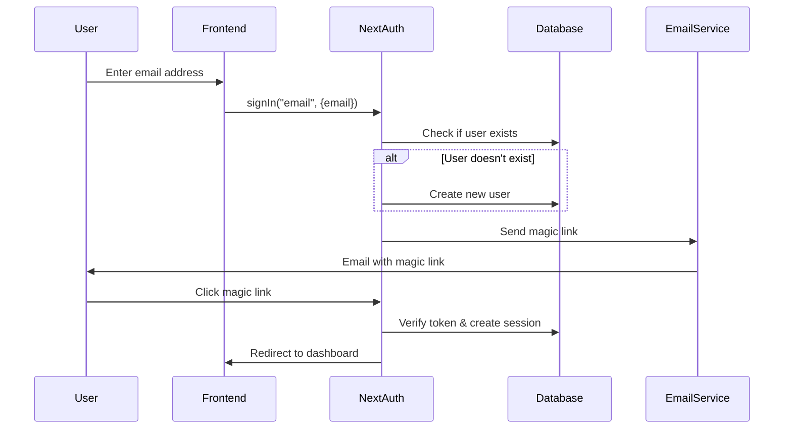

# Design Document

## Overview

The passwordless authentication system will be built using NextAuth.js v4 with a Prisma database adapter, integrating with the existing PostgreSQL database. The system will use email-based magic links sent via nodemailer for authentication, with automatic user registration and session management.

## Architecture

### Authentication Flow


### Database Integration
- Use `@next-auth/prisma-adapter` for database operations
- Extend existing User model to work with NextAuth requirements
- Add NextAuth-required tables: Account, Session, VerificationToken

### Email Service Architecture
- Centralized email service using nodemailer
- Template-based email generation
- SMTP configuration via environment variables
- Error handling and logging

## Components and Interfaces

### 1. Database Schema Extensions

The existing Prisma schema needs to be extended with NextAuth-required models:

```prisma
model Account {
  id                String  @id @default(cuid())
  userId            String
  type              String
  provider          String
  providerAccountId String
  refresh_token     String? @db.Text
  access_token      String? @db.Text
  expires_at        Int?
  token_type        String?
  scope             String?
  id_token          String? @db.Text
  session_state     String?

  user User @relation(fields: [userId], references: [id], onDelete: Cascade)

  @@unique([provider, providerAccountId])
}

model Session {
  id           String   @id @default(cuid())
  sessionToken String   @unique
  userId       String
  expires      DateTime
  user         User     @relation(fields: [userId], references: [id], onDelete: Cascade)
}

model VerificationToken {
  identifier String
  token      String   @unique
  expires    DateTime

  @@unique([identifier, token])
}
```

### 2. NextAuth Configuration

Enhanced `authOptions` configuration:

```typescript
export const authOptions: NextAuthOptions = {
  adapter: PrismaAdapter(prisma),
  providers: [
    EmailProvider({
      server: {
        host: process.env.EMAIL_SERVER_HOST,
        port: Number(process.env.EMAIL_SERVER_PORT),
        auth: {
          user: process.env.EMAIL_SERVER_USER,
          pass: process.env.EMAIL_SERVER_PASSWORD,
        },
        secure: false,
      },
      from: process.env.EMAIL_FROM,
      sendVerificationRequest: customSendVerificationRequest,
    }),
  ],
  callbacks: {
    async signIn({ user, account, profile }) {
      // Custom user creation logic
    },
    async session({ session, user }) {
      // Enhanced session data
    },
  },
  pages: {
    signIn: "/auth/signin",
    verifyRequest: "/auth/verify-request",
    error: "/auth/error",
  },
  session: {
    strategy: "jwt",
    maxAge: 30 * 24 * 60 * 60, // 30 days
  },
}
```

### 3. Email Service Interface

```typescript
interface EmailService {
  sendVerificationEmail(params: {
    to: string;
    url: string;
    identifier: string;
  }): Promise<{success: boolean; messageId?: string; error?: string}>;
}
```

### 4. Environment Configuration

Required environment variables:
```env
# NextAuth
NEXTAUTH_URL=http://localhost:3000
NEXTAUTH_SECRET=your-secret-key

# Database
DATABASE_URL=your-postgresql-url

# Email Configuration
EMAIL_SERVER_HOST=smtp.gmail.com
EMAIL_SERVER_PORT=587
EMAIL_SERVER_USER=your-email@gmail.com
EMAIL_SERVER_PASSWORD=your-app-password
EMAIL_FROM=noreply@meetmischief.com
```

## Data Models

### User Model Extensions
The existing User model will be extended to include NextAuth relationships:

```prisma
model User {
  id        String   @id @default(uuid()) @db.Uuid
  email     String   @unique
  name      String?
  username  String?  @unique
  bio       String?
  timezone  String   @default("UTC")
  createdAt DateTime @default(now()) @db.Timestamptz(6)
  updatedAt DateTime @default(now()) @db.Timestamptz(6)

  // Existing relationships
  availability  Availability[]
  blockedDates  BlockedDate[]
  bookings      Booking[]      @relation("HostBookings")
  
  // NextAuth relationships
  accounts Account[]
  sessions Session[]
}
```

## Error Handling

### Email Delivery Errors
- Retry mechanism for transient failures
- Fallback email service configuration
- User-friendly error messages
- Detailed logging for debugging

### Database Errors
- Connection pool management
- Transaction rollback on failures
- Graceful degradation for non-critical operations

### Authentication Errors
- Token expiration handling
- Invalid token detection
- Rate limiting for sign-in attempts

## Testing Strategy

### Unit Tests
- Email service functionality
- User creation logic
- Session management
- Error handling scenarios

### Integration Tests
- Complete authentication flow
- Database adapter functionality
- Email delivery verification
- Error recovery mechanisms

### End-to-End Tests
- User sign-in journey
- Magic link functionality
- Session persistence
- Cross-browser compatibility

## Security Considerations

### Token Security
- Cryptographically secure token generation
- Time-based token expiration
- Single-use token enforcement

### Email Security
- SPF/DKIM configuration recommendations
- Rate limiting for email sending
- Suspicious activity detection

### Session Security
- Secure cookie configuration
- CSRF protection
- Session invalidation on security events

## Performance Considerations

### Database Optimization
- Proper indexing on frequently queried fields
- Connection pooling configuration
- Query optimization for user lookups

### Email Performance
- Asynchronous email sending
- Queue-based email delivery for high volume
- Connection reuse for SMTP

### Caching Strategy
- Session data caching
- User profile caching
- Email template caching